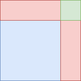
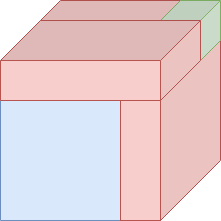

# Cardano’s formula

A quadratic equation is relatively easy to solve, and the Babylonians were aware of methods to solve them in 1600 BC. The cubic formula is significantly harder to solve and it took much longer to find the solution to the general form of the cubic equation: In the 16th century, Italian mathematicians Scipione del Ferro and Niccolo Tartaglia found methods to solve the general cubic equation. Gerolamo Cardano was the first one to publish this method, and the formula is still best known by his name.

Somewhat surprisingly, it is possible to derive Cardano’s formula by using a method that is a three-dimensional analogue of completing the square. I present the derivation here, which is based on [Mieke Jansen’s master thesis]. To fully understand this article, some understanding of [roots of unity](https://en.wikipedia.org/wiki/Root_of_unity) is necessary. However, the lion’s share will be understandable even for those without understanding of roots of unity.

Before considering the cubic formula, we’ll have a look at the method that is called ‘completing the square’.

## Completing the square

Suppose we have a quadratic equation of the form
$$ x^2 + ax = c $$

Any quadratic equation can be written in this form. If we now add some expression, to both sides so that the left side is a perfect square, we can take the square root of both sides. Indeed, this is possible, since we have
$$ (x + \frac{a}{2})^2 = x^2 + ax + (\frac{a}{2})^2 $$

So if we add $\frac{a^2}{4}$ from both sides, the left side is now the square of a linear factor, and we obtain
$$ (x + \frac{a}{2})^2 = c +\frac{a^2}{4} $$

which is quite easy to work out. Assuming that $a$ and $c$ are positive for the moment, we can gain some geometric intuition for the procedure by using this figure:

The blue square has width and height $x$. The red rectangles are chosen so that their area adds up to $ax$, which means that they have one side with length $x$ and one side with length $\frac{a}{2}$. The green square has area $(\frac{a}{2})^2$ and represents the quantity we added.

## Solving the cubic equation

It is not easy to attack the general cubic equation with the same strategy. To make the equation simpler, we use substitution to reduce it to the form
$$ x^3 + px = q $$

This form is called the *depressed cubic*. I now show that the general cubic equation can be reduced to this form. This means that solving cubics of this form means that we are also able to solve cubics of the general form.

Start with an equation in the general form
$$ x^3 + ax^2 + bx = c $$

If we substitute $x = y - \frac{a}{3}$, we obtain
$$ y^3 + (b - \frac{a^2}{3})y = c + a\frac{9b - 2a^2}{27}$$

For simplicity, put $p = b - \frac{a^2}{3}$ and $q = c + a\frac{9b - 2a^2}{27}$ to end up with
$$y^3 + py = q$$

So, if we have cubic equation in the form $x^3 + ax^2 +bx = c$, we can compute $p$ and $q$, and try to find the solution of $y^3 + py = q$. If we have found $y$ we can use $x = y - \frac{a}{3}$ to find $x$.

### Completing the cube

Consider a depressed cubic of the form
$$ y^3 + py = q $$

Now, consider the following three-dimensional analogue of the figure in the last section:

Let $u$ be the length of the side of the large cube that is formed by the blue cube, the red boxes, and the green cube. Let $v = u - y$. Now, the green cube has side $v$ and the blue cube has side $y$. The three red rectangular boxes have sides with lengths $u$, $v$, and $y$, and the big cube that is formed by all the other shapes has side length $u$.

Analogously to the completion of the square, we demand that the volume of the blue cube and the red boxes to add up to $y^3 + py$. Then, since all these boxes have the same volume as the volume of the big cube (with sides $u$) minus the volume of the small cube (with sides $v$), we have $u^3 - v^3 = y^3 + py = q$. Since the blue cube has a volume of $y^3$, each of the three red boxes has volume $\frac{py}{3}$. Since each red rectangular box has a volume of $uvy$, we find $uvy = \frac{p}{3}y$. It follows that $u^3 v^3 = (\frac{p}{3})^3$.

Setting $r = -(\frac{p}{3})^3, s := u^3, t := -v^3$, we obtain the equations $s + t = q$ and $st = r$. In other words, we are looking for two numbers $s, t$ which have sum $q$ and product $r$. Note that this is equivalent to solving the quadratic equation $ z^2 - qz + r = 0$, since $(z - s)(z - t) = z^2 - qz + r$ exactly when the sum of $s$ and $t$ is $q$ and their product is $r$. The solutions are $\frac{q}{2} + \sqrt{(\frac{q}{2})^2 - r}$ and $\frac{q}{2} - \sqrt{(\frac{q}{2})^2-r}$. Note that the expressions are symmetric in $s$ and $t$, so we can choose freely which expression we pick for $s$ and which one for $t$ (as long as we pick $s$ as one of them and $t$ as the other).

Using that $s = u^3$ and $t = -v^3$ , we find
$$u = \sqrt[3]{\frac{q}{2} \pm \sqrt{(\frac{q}{2})^2+(\frac{p}{3})^3}}$$

$$ v = -\sqrt[3]{\frac{q}{2} \mp \sqrt{(\frac{q}{2})^2+(\frac{p}{3})^3}} $$

Note that $u + v$ stays the same, regardless of how we pick the signs in the expression for $u$ and $v$. Using $x = y - \frac{a}{3} = -\frac{a}{3} + u - v$, we find
$$x = -\frac{a}{3} + \sqrt[3]{\frac{q}{2} + \sqrt{(\frac{q}{2})^2+(\frac{p}{3})^3}} + \sqrt[3]{\frac{q}{2} - \sqrt{(\frac{q}{2})^2+(\frac{p}{3})^3}} $$

Where we have $p = b - \frac{a^2}{3}$ and $q = c + a\frac{9b - 2a^2}{27}$.

## Summary

Algebraically, we can summarize the steps we took as follows:

Take the equation
$$ x^3 + ax^2 + bx = c $$

Substitute
$$ y = x + \frac{a}{3} $$

$$ p = b - \frac{a^2}{3} $$

$$ q = c + a \frac{9b-2a^2}{27} $$

We now have the following polynomial equation in $y$:
$$ y^3 + py = q $$

Introduce $u, v$ that satisfy $y = u - v$ and $uv = \frac{p}{3}$. From this, we can derive
$$ u^3 - v^3 = q $$
$$ u^3 v^3 = (\frac{p}{3})^3 $$

Now substitute
$$ s = u^3 $$

$$ t = v^3 $$

$$ r = (\frac{p}{3})^3 $$

So that we have
$$ s - t = q $$

$$ st = r $$

These equations have the following solution, where $s$ and $t$ are interchangeable:
$$ s, t = \frac{q}{2} \pm \sqrt{(\frac{q}{2})^2 + (\frac{p}{3})^3} $$

If we substitute back and try to express $s$ and $t$ in $a, b$, and $c$, we find
$$ x = y - \frac{a}{3} $$

where
$$ y = \sqrt[3]{\frac{q}{2} + \sqrt{(\frac{q}{2})^2+(\frac{p}{3})^3}} + \sqrt[3]{\frac{q}{2} - \sqrt{(\frac{q}{2})^2+(\frac{p}{3})^3}} $$

and
$$ p = b - \frac{a^2}{3} $$

$$ q = c + a \frac{9b-2a^2}{27} $$

You might have noticed that we find only one solution. It is actually possible to find the other two solutions with a slight change in the formula, which I’ll explain in the last section. If you like a good challenge, try to find out why we don’t find all solutions, and try to modify the formula to provide all complex solutions of the cubic formula (if you need a hint, take a look at the second paragraph).

## Simplifying the result

In retrospect, it would be easier to use variables that equal $\frac{p}{3}$ and $\frac{q}{2}$ instead. Using this, and some other simplifications, we find the solution
$$x = -A + \sqrt[3]{C + \sqrt{D}} + \sqrt[3]{C - \sqrt{D}}$$

where $A = \frac{a}{3}, B := \frac{b}{3} - A^2, C = \frac{c + A(b - 2A^2)}{2}$ and $D = C^2+B^3$

for the equation
$$x^3 + ax^2 + bx = c$$

## What about the other solutions?

As we know from the [fundamental theorem of algebra](https://en.wikipedia.org/wiki/Fundamental_theorem_of_algebra), a cubic equations has three (complex) solutions. Yet the formula we found only provides a formula for one of those roots. Indeed we missed some solutions. Specifically, when we took the cube root of $s$ and $t$, we only considered the single real solution. Instead, there are three solutions, which can be deduced from the fundamental theorem of algebra. Specifically, for a real number $w$, the formula
$$ z^3 = w $$

has the solutions $\sqrt[3]{w}, \omega \sqrt[3]{w}$, and $\omega^2 \sqrt[3]{w}$. We missed the last two solutions. However, if we consider all those solutions in $u$ and $v$, we obtain 8 new solutions, which is more than expected. Not all of these are indeed solutions of the cubic equation. While all our solutions satisfy $u^3 v^3 = (\frac{p}{3})^3$, the stronger condition $uv = \frac{p}{3}$ is not always satisfied. This condition can be satisfied by making sure that we pick solutions $\omega_3^k \sqrt[3]{s}$ and $\omega_3^{-k} \sqrt[3]{t}$ for $u$ and $v$ (so that $uv = \sqrt[3]{s} \sqrt[3]{t} = \frac{p}{3}$).

## Statement of the final result

**Theorem**: Consider the equation $x^3 + ax^2 + bx = c$. Let $A = \frac{a}{3}, B := \frac{b}{3} - A^2, C = \frac{c + A(b - 2A^2)}{2}$, $D = C^2 + B^3$, and $\omega_3 \not = 1$ a cube root of unity. Substituting $k = 0, 1, 2$ in
$$x = -A + \omega_3^k \sqrt[3]{C + \sqrt{D}} + \omega_3^{-k}\sqrt[3]{C - \sqrt{D}}$$

gives all three solutions of the equation. Moreover, if $D \geq 0$, the solution for $k = 0$ is real.

**Proof**: Substitute the expression in $x^3 + ax^2 + bx = c$, simplify, and observe that the result is 0. If $D \geq 0$ and $k = 0$, the expression involves only real numbers, so the result will be real as well. $\square$

[Mieke Jansen’s master thesis]: http://www.ratio.ru.nl/website/content/bijlagen/azl/abcd.pdf
