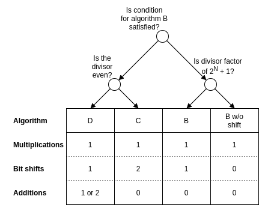

# Division by constant unsigned integers

Most modern processors have an integer divide instruction which is relatively slow compared to the other arithmetic operations. When the divisor is known at compile-time or the same divisor is used for many divisions, it is possible to transform the single division to a series of instructions which execute faster. Most compilers will optimize divisions in this way. The [libdivide](https://libdivide.com/) library implements this technique for divisors which are constant at runtime but not known at compile-time. In this article, I give an overview of the existing techniques.

The number that is being divided is called the *dividend*. The dividend is divided by $d$, the *divisor*. The rounded down result $\lfloor \frac{n}{d} \rfloor$ is called the *quotient*.

For some special divisors, the quotient can be found very efficiently. A division by one just returns the dividend and division by another power of two can be implemented by a bit shift. When the divisor is larger than half of the maximum value of the dividend, the quotient is one when $n \geq d$ and zero otherwise. This can be efficiently implemented. This technique can be extended to slightly smaller divisors. For example, divisors larger than $\frac{n}{3}$ the quotient can only assume the values $0$, $1$, or $2$, and this division can be implemented as:
```
let d be such that (2^32 - 1) / 3 < d < (2^32 - 1) / 2

uint32_t divide(uint32_t n) {
	uint32_t quotient = 0;
	if (n >= d) quotient++;
	if (n >= 2 * d) quotient++;
	return quotient;
}
```

This approach has quickly diminishing results, though.

Compilers should take advantage of these special cases when possible, because they usually allow for faster code to be emitted. I will ignore these cases in the rest of the article.

A more generally applicable technique uses the idea of multiplying by a constant that approximates the reciprocal of the divisor in fixed point math. This means that, when we want to divide by a divisor $d$, we multiply the dividend by some constant $m$ with
$$ m \approx \frac{2^k}{d} $$

and shift the result $k$ bits to the right. Here, $k$ is a measure of how precise the fixed-point approximation is to $\frac{1}{d}$. Setting $k$ higher will yield a more precise approximation, but also increase the number of bits that we need to store $m$.

Ideally, we would be able to obtain the right answer by simply ignoring everything behind the decimal point, since this can be implemented by a right shift, which is a very efficient operation. Before going any further, let's define the problem more formally. In this article, I'll only cover unsigned integers.

I assume that we are working on a processor with $N$-bit registers. I'll also assume that the processor has a `muluh` instruction, which operates on two $N$-bit unsigned integers and computes the upper $N$ bits of the product. The examples I give will be in pseudocode, in which I will use the `muluh` instruction as if it were a function. Further, I assume that the reader is familiar with the right shift operator `>>`. I will use it as a primitive in the pseudocode without further explanation.

**Definition**: *Let $\mathbb{U}_N$ denote the set of unsigned integers which can be represented in $N$ bits with the binary encoding. That is:*
$$ \mathbb{U}_N = \{ 0, 1, ..., 2^N - 2, 2^N - 1 \} $$

**Problem**: *Given a divisor $d \in \mathbb{U}_N$ which is not a power of two, find $m, k \in \mathbb{N}$ such that*
$$ \lfloor \frac{n \cdot m}{2^k} \rfloor = \lfloor \frac{n}{d} \rfloor $$

*for all $n \in \mathbb{U}_N$.*

Ideally, we would have $m \in \mathbb{U}_N$ so that we can store $m$ in a single register. Later, we will derive a condition that can be used to check if this is the case.

From this formulation we would expect that $m \approx \frac{2^k}{d}$. Suppose we pick some $d \in \mathbb{N}^+$ which is not a power of two and take $m = \lfloor \frac{2^k}{d} \rfloor$. If we now set $n = d$ and try to find the quotient $\lfloor \frac{n}{d} \rfloor$ by evaluating $\lfloor \frac{n \cdot m}{2^k} \rfloor$, we get
$$ \lfloor \frac{d \cdot \lfloor \frac{2^k}{d} \rfloor}{2^k} \rfloor = 0 < 1 = \lfloor \frac{d}{d} \rfloor $$

So we get the result $0$, instead of the expected $1$. So taking $m = \lfloor \frac{2^k}{d} \rfloor$ does not work: The product $n \cdot m$ is too small. To fix this, we can increase $m$, which is equivalent to taking $m = \lceil \frac{2^k}{d} \rceil$ when $d$ is not a power of two. Alternatively, we can slightly alter to the problem formulation so that we are allowed to increase $n$. As we will see later, these are both useful and even complementary techniques. 

If we experiment a bit, setting $m = \lceil \frac{2^k}{d} \rceil$ and picking some high enough $k$ seems to work. If we want to use this as a compiler optimization we need to figure out for which $d$ this works, and that the outcome is correct for all $n \in \mathbb{U}_N$. So, we need to do an error analysis. The following lemma turns out to be very useful.

**Lemma 1**: *Suppose that $d \in \mathbb{N}_+$ is a positive integer. When $0 \leq \epsilon < \frac{1}{d}$ we have*
$$ \lfloor \frac{n}{d} + \epsilon \rfloor = \lfloor \frac{n}{d} \rfloor $$

**Proof**: If $\epsilon = 0$ the result obviously holds. If $0 < \epsilon < \frac{1}{d}$ the expression $\frac{n}{d} + \epsilon$ is not an integer and we have
$$ \lfloor \frac{n}{d} \rfloor \leq \lfloor \frac{n}{d} + \epsilon \rfloor < \lceil \frac{n}{d} + \epsilon \rceil = \lfloor \frac{n}{d} \rfloor + 1 $$

where the equality follows from the fact that $\epsilon < 1$. Since all of these expressions in the inequality are integers, it follows that $\lfloor \frac{n}{d} + \epsilon \rfloor = \lfloor \frac{n}{d} \rfloor$.
$\square$

Now, we can write $m = \lceil \frac{2^k}{d} \rceil = \frac{2^k + e}{d}$ with $e = \text{mod}_d(-2^k)$ and substitute this in $\lfloor \frac{n \cdot m}{2^k} \rfloor$, write the resulting expression in the form $\lfloor \frac{n}{d} + \epsilon \rfloor$ with $\epsilon$ a function of $n$, $d$, $e$, and simply check under which condition we have $0 < \epsilon < \frac{1}{d}$. This gives us the following theorem:


**Theorem 2**: *Let $d \in \mathbb{U}_N$ and $k \in \mathbb{N}_+$ be positive integers with $N \leq k \leq N + \lceil \log_2(d) \rceil$, and let $m = \lceil \frac{2^k}{d} \rceil$. If $\text{mod}_d(-2^k) \leq 2^{k - N}$, then $\lfloor \frac{m \cdot n}{2^k} \rfloor = \lfloor \frac{n}{d} \rfloor$ for all $n \in \mathbb{U}_N$.*

**Proof**: Write $m = \lceil \frac{2^k}{d} \rceil = \frac{2^k + e}{d}$ with $e = \text{mod}_d(-2^k) \in \{ 0, 1, ..., d - 1 \}$. Now we have
$$ \lfloor \frac{m \cdot n}{2^k} \rfloor = \lfloor \frac{\frac{2^k + e}{d} \cdot n}{2^k} \rfloor = \lfloor \frac{n}{d} + \frac{ne}{d2^k} \rfloor = \lfloor \frac{n}{d} + \epsilon \rfloor $$

with $\epsilon = \frac{e \cdot n}{2^k d}$. We have $e \leq 2^{k - N}$ and $n < 2^N$. All the values in the inequalities are positive, so we are allowed to multiply the inequalities to get
$$ 0 \leq e \cdot n < 2^k \iff 0 \leq \frac{e \cdot n}{2^k d} < \frac{1}{d} $$

Since $\epsilon = \frac{e \cdot n}{2^k d}$ the right hand side just states that $0 \leq \epsilon < \frac{1}{d}$. So the lemma applies and we have $\lfloor \frac{m \cdot n}{2^k} \rfloor = \lfloor \frac{n}{d} + \epsilon \rfloor = \lfloor \frac{n}{d} \rfloor$. $\square$

Using the bound $\text{mod}_d(-2^k) < d$ we can derive an useful corollary:

**Corollary 1**: *Let $d \in \mathbb{U}_N$, $k = N + \lceil \log_2(d) \rceil$, and $m = \lceil \frac{2^k}{d} \rceil$. Then $\lfloor \frac{m \cdot n}{2^k} \rfloor = \lfloor \frac{n}{d} \rfloor$ for all $n \in \mathbb{U}_N$.*

**Proof**: We have $\text{mod}_d(-2^k) < d \leq 2^{\lceil \log_2(d) \rceil} = 2^{k - N}$. So we have $\text{mod}_d(-2^k) \leq 2^{k - N}$ and by theorem 1 it follows that $\lfloor \frac{m \cdot n}{2^k} \rfloor = \lfloor \frac{n}{d} \rfloor$. $\square$

Now, we would like to know how many bits we need to hold $m$. We have $1 \leq \frac{2^{\lceil \log_2(d) \rceil}}{d} < 2$, so we would expect that $\lfloor \frac{2^{p + \lceil \log_2(d) \rceil - 1}}{d} \rfloor$ and $\lceil \frac{2^{p + \lceil \log_2(d) \rceil - 1}}{d} \rceil$ both need $p$ bits to represent. The following theorem, which is surprisingly involved to prove, confirms this. Feel free to skip the proof.

**Theorem 3**: *Let $d \in \mathbb{U}_p$ with $d \neq 0$ and let $p \in \mathbb{N}_+$. Then*
$$ 2^{p - 1} \leq \lfloor \frac{2^{p + \lceil \log_2(d) \rceil - 1}}{d} \rfloor \leq \lceil \frac{2^{p + \lceil \log_2(d) \rceil - 1}}{d} \rceil < 2^p $$

**Proof**: The result can easily be checked for $d = 1$. For $p = 1$ the only $d \in \mathbb{U}_p$ is $d = 1$, so we can assume that $d, p > 1$. Note that the result follows from taking the floor and ceiling of
$$ 2^{p - 1} \leq \frac{2^{p + \lceil \log_2(d) \rceil - 1}}{d} \leq 2^p - 1 $$

So it suffices to prove this inequality. From $d \leq 2^{\lceil \log_2(d) \rceil}$ it follows that $2^{p - 1} \leq \frac{2^{p + \lceil \log_2(d) \rceil - 1}}{d}$. So it remains to show that
$$ \frac{2^{p + \lceil \log_2(d) \rceil - 1}}{d} < 2^p - 1 $$

Define $q = \lceil \log_2(d) \rceil - 1$. Since $2^{q + 1}$ is the first power of two that is larger than or equal to $d$ and $d < 2^p$, we have $2^q < d \leq 2^{q + 1} \leq 2^p$. Divide the inequality by $2^p$ to get
$$ \frac{2^q}{d} < \frac{2^p - 1}{2^p} $$

Using $d \geq 2^q + 1$ we see that $\frac{2^q}{d} \leq \frac{2^q}{2^q + 1}$, so it is enough to show
$$ \frac{2^q}{2^q + 1} < \frac{2^p - 1}{2^p} $$

Multiply both sides by $2^p \cdot (2^q + 1)$ to get
$$ 2^{p + q} < (2^p - 1) \cdot (2^q + 1) = 2^{p + q} + 2^p - 2^q - 1$$

This is equivalent to $2^q + 1 < 2^p$. Using $p > 1$ and $p > q$, this equality follows from
$$ 2^q + 1 < 2^q + 2^{p - 1} \leq 2^{p - 1} + 2^{p - 1} = 2^p $$

$\square$

Unfortunately we can now see that when we set $k = N + \lceil \log_2(d) \rceil$ and $m = \lceil \frac{2^k}{d} \rceil$ we have $2^N \leq m \leq 2^{N + 1} - 1$. This unfortunately means that $m$ is exactly one bit too large to fit in an $N$-bit register. This is not insurmountable. In [1], a technique for multiplying by an $(N + 1)$-bit constant on a processor with $N$-bit registers is presented. This is illustrated in algorithm A.

```
# Algorithm A
# -----------
# Divide an N-bit unsigned integer by another N-bit unsigned integer by means
# of multiplication by an (N + 1)-bit unsigned constant followed a bit shift.
# The implementation uses more operations in order to avoid overflow.

Let d be any N-bit unsigned divisor
Let k = N + ceil(log2(d)) and m' be the lower N bits of ceil(2^k / d)
Let shift1 = min(k - N, 1) and shift2 = max(k - N - 1, 0)

function fast_divide(n):
	hiword = muluh(n, m')
	return (hiword + (n - hiword) >> shift1) >> shift2
```

**Note**: *Algorithm A can be used for all divisors $d$ and has a runtime cost of one multiplication, two additions/subtractions, and two bit shifts.*

This is a promising first method. If you just don't care about having the absolute fastest algorithm for division, I would advise you to implement this algorithm. Algorithm A is a relatively simple method which works for all integers. It can also be extended to the case of division of signed integers without a lot of effort.

It is possible to improve algorithm A: For some divisors, we might be able to find a smaller $k$, so that $m$ fits in a single register. For architectures on which multiplication and/or bit shifts by higher constants are slower, it may be useful to use theorem 1 to find the smallest $k$ for which $\text{mod}_d(-2^k) < 2^{k - N}$. The following C code can be used to find such $k$. It is assumed that $N = 32$.

```
int find_k(uint32_t d, bool *fits_in_single_register) {
	int k = ceillog = ceil_log2(d);
	// -2^32 % d = (d - 2^32) % d = (uint32_t)(-d) % d.
	uint32_t mod = (uint32_t)(-d) % d;
	*fits_in_single_register = true;
	for (int k = 32; k < 32 + ceillog; k++) {
		if (mod <= (1 << (k - 32)) return k;
		// overflow-safe way of doubling modulo d
		if (mod < d - mod) mod += mod; else mod += mod - d;
	}
	*fits_in_single_register = false;
	return 32 + ceillog;
}
```

If we found a $k$ such that $N \leq k < N + \lceil \log_2(d) \rceil$ with $\text{mod}_d(-2^k) \leq 2^{k - N}$, we can use a single $N$-bit register to hold $m$ and we don't have to use tricks to multiply by an $(N + 1)$-bit constant. So in this case the `fast_divide` function becomes simpler.

```
# Algorithm B
# -----------
# Divide an N-bit unsigned integer by another N-bit unsigned integer by means
# of multiplication by an N-bit unsigned constant, followed a bit shift.

Let d be a N-bit unsigned divisor and let N <= k < N + ceil(log2(d))
with -2^k % d <= 2^(N - k) (this is not possible for every d)
Let m = ceil(2^k / d)

function fast_divide(n):
	hiword = muluh(n, m)
	return hiword >> (k - N)
```

**Note**: *Algorithm B can only be used for some divisors $d$ and has a runtime cost of one multiplication and one bit shift.*

For some divisors we have $k = N$, and we can leave out the shift. This happens for divisors of $2^N + 1$ (since then we have $\text{mod}_d(-2^N) = 1 \leq 2^{k - N}$).

Algorithm B is very efficient, but it can also be used when we find a $k \in \mathbb{N}$ such that $N \leq k < N + \lceil \log_2(d) \rceil$ and $\text{mod}_d(-2^k) \leq 2^{k - N}$. For even divisors for which this is not the case, we can still save the situation by first dividing the dividend $n$ by two with a bit shift. We only need $N - 1$ bits to hold the resulting dividend. Using the bound from theorem 1, we see that we can now decrease $k$ by one from $N + \lceil \log_2(d) \rceil$ to $N + \lceil \log_2(d) \rceil - 1$. So $m$ will fit in a single $N$-bit register. We get the following algorithm:

```
# Algorithm C
# -----------
# Divide an N-bit unsigned integer by another N-bit unsigned integer by means
# of multiplication by an N-bit unsigned constant, followed a bit shift.

Let d be an even N-bit unsigned divisor
Let k = N + ceil(log2(d)) - 1 and m = ceil(2^k / d)

function fast_divide(n):
	n = n >> 1
	hiword = muluh(n, m)
	return hiword >> (k - N)
```

**Note**: *Algorithm C has a runtime cost of one multiplication and two shifts.*

For odd divisors for which $m$ does not fit in a single word, one option is to resort to algorithm A, which uses a multiplication by an $(N + 1)$-bit constant. Alternatively, we can try the other strategy mentioned before: increase $n$ instead of $m$.

**Theorem 4**: *Let $d \in \mathbb{U}_N$ be a positive number that is not a power of two, let $k \in \mathbb{N}$ such that $N \leq k < N + \lceil \log_2(d) \rceil$, and let $m = \lfloor \frac{2^k}{d} \rfloor$. Then $m \in \mathbb{U}_N$ and if $\text{mod}_d(2^k) \leq 2^{k - N}$, then $\lfloor \frac{m \cdot (n + 1)}{2^k} \rfloor = \lfloor \frac{n}{d} \rfloor$ for all $n \in \mathbb{U}_N$.*

**Proof**: Write $m = \lceil \frac{2^k}{d} \rceil = \frac{2^k - e}{d}$ with $e = \text{mod}_d(2^k)$. Now we have
$$ \lceil \frac{m \cdot (n + 1)}{2^k} \rceil = \lceil \frac{\frac{2^k - e}{d} \cdot (n + 1)}{2^k} \rceil = \lfloor (1 - \frac{2}{2^k}) \cdot \frac{n + 1}{d} \rfloor$$

$$ = \lfloor \frac{n}{d} + \frac{1}{d} - \frac{e}{2^k} \cdot \frac{n + 1}{d} \rfloor = \lfloor \frac{n}{d} + \epsilon \rfloor$$

with $\epsilon = \frac{1}{d} - \frac{e}{2^k} \cdot \frac{n + 1}{d}$. Multiplying the inequalities $e \leq 2^{k - N}$ and $n + 1 \leq 2^N$ gives $e(n + 1) \leq 2^k$. Since $d$ is now a power of two, $n + 1$ and $e$ are both positive, so we have $e \cdot (n + 1) > 0$. Combining this, we see
$$ 0 < e \cdot (n + 1) \leq 2^k $$

If we multiply by $\frac{-1}{d2^k}$, which flips the inequalities, and add $\frac{1}{d}$ everywhere, we get
$$ 0 \leq \frac{1}{d} - \frac{e}{2^k} \cdot \frac{n + 1}{d} < \frac{1}{d} $$

The expression in the middle is exactly $\epsilon$, which means we have $0 \leq \epsilon < \frac{1}{d}$. So the lemma applies and we have $\lfloor \frac{n \cdot (n + 1)}{d} \rfloor = \lfloor \frac{n}{d} + \epsilon \rfloor = \lfloor \frac{n}{d} \rfloor$. $\square$

There are different ways to evaluate the product $m \cdot (n + 1)$. The most efficient method depends on the target architecture. I will elaborate on the possible methods later.

```
# Algorithm D
# -----------
# Divide an N-bit unsigned integer by another N-bit unsigned integer by means
# of multiplication by an N-bit unsigned constant, followed a bit shift.

Let d be a N-bit unsigned divisor for which no k exists such that
N <= k < N + ceil(log2(d)) and -2^k % d <= 2^(N - k)

Let k be such that N <= k < N + ceil(log2(d)) and 2^k % d <= 2^(N - k)
Let m = floor(2^k / d)

function fast_divide(n):
	compute the high word of m * (n + 1) while avoiding overflow
	return hiword >> (k - N)
```

The following theorem now says that for any divisor for which the condition for algorithm B does not hold, the condition for algorithm D holds. In other words, for a given divisor, we can always either use algorithm B or algorithm D.

**Theorem 5**: *Let $d \in\mathbb{U}_N$ be a positive integer such that there exists no $k \in \mathbb{N}$ with $N \leq k < N + \lceil \log_2(d) \rceil$ such that $\text{mod}_d(-2^k) \leq 2^{k - N}$. Then there exists a $k \in \mathbb{N}$ with $N \leq k < N + \lceil \log_2(d) \rceil$ such that $\text{mod}_d(2^k) \leq 2^{k - N}$.*

**Proof**: Assume that $d$ does not satisfy the condition. Set $k = N + \lceil \log_2(d) \rceil - 1$ and $e_B = \text{mod}_d(-2^k), e_D = \text{mod}_d(2^k)$. We now have $e_B + e_D = d$ since $e_B + e_D \equiv 0 \mod d$ and $e_B, e_D \in \{ 0, 1, ..., d - 1 \}$. By assumption we have $e_B > 2^{k - N} = 2^{\lceil \log_2(d) \rceil - 1}$ so that $e_D \leq d - 2^{\lceil \log_2(d) \rceil - 1}$. Using that $\frac{d}{2} \leq 2^{\lceil \log_2(d) \rceil - 1}$ we see
$$ e_D \leq d - 2^{\lceil \log_2(d) \rceil - 1} \leq \frac{d}{2} \leq 2^{\lceil \log_2(d) \rceil - 1} = 2^{k - N}$$

So we have $e_D = \text{mod}_d(2^k) \leq 2^{k - N}$. $\square$

As discussed before, the most efficient method of evaluating $n \cdot (n + 1)$ depends on the target. If we simply increment $n$, we might cause an overflow. One method is to compute $m \cdot (n + 1)$ as $m \cdot n + m$. For this, it is necessary to compute the full $2N$-bit product $m \cdot n$, and to add the $N$-bit value $n$ to it.  If the target architecture has an integer fused multiply-add instruction, it might be used for this computation. For example, in [2], the Intel Celeron instruction `XMA.HU` is used for this purpose. Another solution, introduced in [4], is to use a 'saturating increment', which increases $n$ only if $n < 2^N - 1$, so that overflow doesn't occur. This is reported to be slightly more efficient than calculating $m \cdot (n + 1)$. A saturating add will yield the right result as long as we only use algorithm D only for divisors for which the condition for algorithm B does not hold.

This can be shown as follows: If $n = 2^N - 1$, the saturating increase will do nothing, since $n = 2^N - 1$ is the maximum value that can be contained in $N$ bits. In this case, we effectively compute $\lfloor \frac{2^N - 2}{d} \rfloor$. However, if $d$ is not a factor of $2^N - 1$, we have $\lfloor \frac{2^N - 1}{d} \rfloor = \lfloor \frac{2^N - 2}{d} \rfloor$, so we still get the right answer.

If $d$ is a factor of $2^N - 1$, take $k = \lceil \log_2(d) \rceil - 1$ and $e_B = \text{mod}_d(-2^k), e_D = \text{mod}_d(-2^k)$. Then
$$ e_D = \text{mod}_d(2^k) = \text{mod}_d(2^N \cdot 2^{\lceil \log_2(d) \rceil - 1}) = \text{mod}_d(2^{\lceil \log_2(d) \rceil - 1}) = 2^{\lceil \log_2(d) \rceil - 1}$$

Here we used that $2^N \equiv 1 \mod d$ since $d$ is a factor of $2^N - 1$, and $2^{\lceil \log_2(d) \rceil - 1} < d$. We have $e_B + e_D = d$ since $e_B, e_D \equiv 0 \mod d$ and $e_B, e_D' \in \{ 0, 1, ..., d - 1 \}$. So
$$ e_B = d - e_D \leq 2^{\lceil \log_2(d) \rceil} - 2^{\lceil \log_2(d) \rceil - 1}  = 2^{\lceil \log_2(d) \rceil - 1} = 2^{k - N} $$

This means that the condition for algorithm B is satisfied, and algorithm B should be used. So as long as algorithm B is used when possible, a saturating increase can be used for algorithm D.

## Overview

Quite a lot of different algorithms have been presented. The following map can be used as a rough guide to the most efficient algorithm for a given divisor. When the answer to a question is "no", the left arrow should be followed from that circle. Otherwise, the right arrow should be followed. The algorithms are roughly ordered from slow on the left side, to fast on the right side. For brevity I have ignored the simple optimizations mentioned at the start of this article.

The "condition for algorithm B" which is mentioned in the flowchart, is that there exists a $k \in \mathbb{N}$ with $N \leq k < N + \lceil \log_2(d) \rceil$ such that $\text{mod}_d(-2^k) < 2^{k - N}$.



If you don't care about having the absolute best algorithm, I recommend that you ignore the whole flowchart and implement algorithm A, with special cases for division by one or by powers of two. This algorithm is slightly slower than the other ones, but has a simpler implementation and works for all divisors. Moreover, it can also be extended to deal with signed integers.

For constants that are known at runtime but not at compile time, I suggest a method that picks one of algorithm B and D, and uses the following structure:

```
struct fast_division_data {
	uint32_t m, add, shift;
}
```

Algorithm B fills `m` and `shift` and sets `add` to zero. Algorithm D sets `m` and shift, and sets `add` to `m`. This is basically the method described in [2]. The division can now be evaluated with the following function:
```
uint32_t fast_divide(uint32_t n, fast_division_data data) {
	uint32_t hi_word = ()(((uint64_t)m * (uint64_t)n + add) >> 32);
	return hi_word >> shift;
}
```


## Further reading

The classic work on the subject of dividing by constants is [1], which also also covers division by signed constants and testing for divisibility. Algorithm A is based on this work. In [3] and [4] a very readable introduction to division of unsigned constants is given. Further, the idea of using the saturating increment in algorithm D is introduced. The paper [2] contains many similar ideas, but is a bit more formal.

### References

[1]: [Division by Invariant Integers using Multiplication](https://gmplib.org/~tege/divcnst-pldi94.pdf), Torbjörn Granlund and Peter L. Montgomery, 1994.

[2]: [N-Bit Unsigned Divison Via N-Bit Multiply-Add](https://citeseerx.ist.psu.edu/viewdoc/download?doi=10.1.1.512.2627&rep=rep1&type=pdf), Arch D. Robinson, 2005.

[3]: [Labor of Divison (Episode I)](https://ridiculousfish.com/blog/posts/labor-of-division-episode-i.html), fish, 2010.

[4]: [Labor of Divison (Episode III): Fast Unsigned Division by Constants](https://ridiculousfish.com/blog/posts/labor-of-division-episode-iii.html), fish, 2011.
