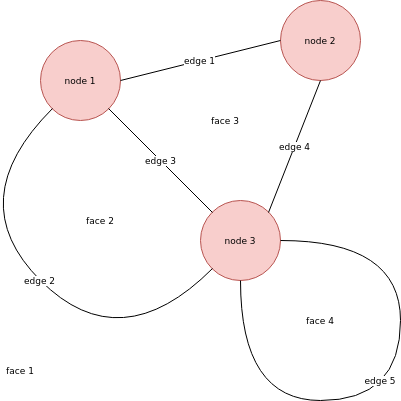

# Euler’s formula for connected planar graphs

An undirected [graph](https://en.wikipedia.org/wiki/Graph_(discrete_mathematics)) is *connected* when there exists a path of edges between every two nodes. A graph is *planar* when it can be embedded in a plane without edges crossing each other.

A section of the plane that is closed in by edges is called a *face*:

For the number of nodes, edges, and faces in a nonempty connected planar graph, we have the following theorem:

**Theorem (Euler)**: *Let $G$ be a nonempty planar graph. Denote the number of vertices of $G$ by $v$, the number of edges of $G$ by $e$, and the number of faces of $G$ by $f$. Then*
$$ v + f - e = 2$$

**Proof**: We use induction on the number of edges plus the number of faces. The simplest nonempty graph consists of a single node. Since there is one face (the plane itself), one node, and no edges, the formula holds. Now, if we have a graph for which this formula holds, we can add a new node and connect it to some existing node with an edge. In this case the number of nodes and edges both increase by one, so the formula still holds. Alternatively, we can add an edge by connecting two nodes. Since the graph is connected, this edge creates a loop, so this adds a new face. This means the number of edges and the number of faces both increase by one, so the formula still holds.

Since we can build every nonempty connected planar graph in this way, it follows that the formula holds for every nonempty connected planar graph. $\square$
