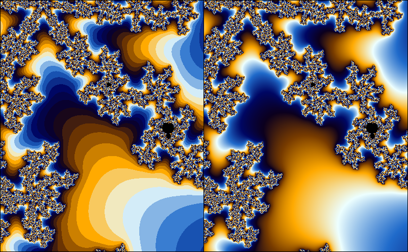

# Smooth iteration count for the Mandelbrot set

The exterior of the Mandelbrot set is usually colored by using the number of iterations. As the number of iterations is a discrete quantity, this leads to the occurrence of banding in the coloring. In this article, I will derive a formula for a fractional iteration count. This is by no means novel; plenty of derivations can be found on the internet. However, I found most derivations to be fairly hard to follow, and hope that my explanation may be helpful to at least some people.

## Mandelbrot formula

To check if a point is in the Mandelbrot set, we iterate
$$z_{k + 1} = z_k^2 + c$$

If $\lim_{k \rightarrow \infty} |z_k| = \infty$, the set is outside the Mandelbrot set, otherwise, it is in the Mandelbrot set. In practice, we just iterate a fixed number of times, and check that $|z_k|$ stays within an *escape radius* $R$. It can be shown that when $|z_k| > 2$ for some $k$, then $\lim_{k \rightarrow \infty} |z_k| = \infty$. So, in a sense, $R = 2$ is big enough. However, when we color the fractal based on the number of iterations, the escape radius matters, so in this article I'll use a general escape radius $R$.

I will use the following conventions: the magnitude of the iterand $z_k$ is denoted by $r_k = |z_k|$. The first $n$ such that $r_n > R$ for a given $z_0$ is called the *iteration count* for the point $z_0$.

While the iterands $z_0, z_1, ...$ (and thus, their magnitudes) depend on the starting point in a continuous way, the iteration count ‘jumps’ to discrete values. Suppose that $\epsilon > 0$ is a very small number. A starting point for which $r_n = R + \epsilon$ will have an iteration count of $n$, while a starting point with $r_n = R - \epsilon$ will have iteration count $n + 1$. If we would have some kind of measurement for the amount by which the iterand has escaped the escape radius $R$, we could use this to assign a fractional part of the iteration count. That is, the iterand with $r_n = R + \epsilon$ would have an iteration count slightly lower than $n$, while the iterand with $r_n = R - \epsilon$ would have an iteration count slightly higher than $n$.

Ideally, we would like to have a smooth function $f : \mathbb{R} \rightarrow \mathbb{R}$ such that $f(k) = | z_k |$ for $k \in \mathbb{N}$, and find the smallest $x_R > 0$ such that $f(x_R) = R$. Instead of trying to find such a function, we will try to approximate it locally.

Suppose that $x_R$ is the smallest number such that $f(x_R) = R$. We then have $z_{n+1} = z_n^2 + c$. Assuming that $c$ is small with respect to $R$, we get
$$ f(x_R + 1) \approx R^2  $$

Likewise, we find $f(x_R + 2) = R^4, f(x_R + 3) = R^8$, or, more generally, $f(n + \epsilon) = R^{2^\epsilon}$. Note that this is a perfectly fine approximation even when $\epsilon$ is real. So now we can try to solve
$$ f(x_R + \epsilon) = R^{2^\epsilon} = r_n $$

for $\epsilon$. In doing so, we find $\epsilon = \log_2(\log_R(r_n))$. Since $f(n) = r_n$, we have $n = x_R + \epsilon$, so for the fractional iteration count $x_R$ we find
$$x_R = n - \log_2(\log_R(r_n))$$

where $R$ is the escape radius, $r_n = |z_n|$, and $n$ is the classical iteration count (i.e. the smallest $n$ such that $|z_n| > R$).

**Exercise**: a) *Suppose that we instead chose to approximate $f(x)$ at $x = n$ instead of $x = x_R$. Show that we would have end up with*:
$$ x_R = n + \log_2(\log_{r_n}(R)) $$

b) *Show that these expressions are the same. Hint: Use $\log_b(x) = \frac{\log_c(x)}{\log_c(b)}$ and $\log(\frac{1}{x}) = -\log(x)$.*

c) *Show that taking if we would take another base instead of $R$ for the inner logarithm, we would still get a smooth coloring, but if we would take another base instead of 2 for the outer logarithm, we would get a non-smooth coloring. Hint: use that $\log(xy) = \log(x) + \log(y)$.*

It is not hard to see that the smooth iteration count is continuous. Imagine we are picking a starting point in a fractal colored with the discrete iteration count. Suppose the starting point has iteration count $n$. If we move the starting point $z_0$ around a little bit, but no so much that the discrete iteration count changes, the smooth iteration count is a continuous function of $z_0$. We can visualize this as moving the starting point without leaving the 'band' that the starting point is in. When we move the starting point so much that it approaches the outer edge of its band, we see that the smooth iteration count will approach $n$. Likewise, if we move the starting point near the inner edge of the of the band, the smooth iteration count will approach $n + 1$. This means that the smooth iteration count is continous, even as the starting point crosses bands, since the smooth iteration count will assume the value $n$ on the border between the $n$th and the $n + 1$th band.
